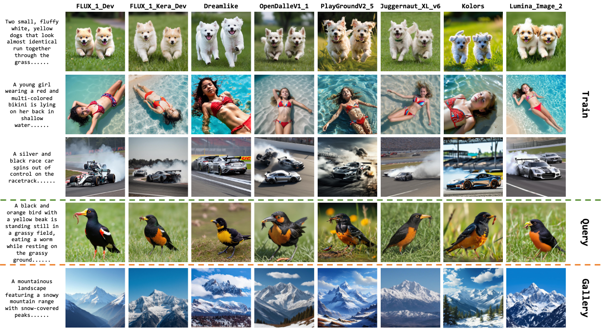

# AIGCTraceability

AIGC图像溯源与深度伪造检测平台，提供多种深度学习模型用于检测和追踪AI生成的图像。

## 项目简介

本项目旨在解决AIGC（AI生成内容）图像的溯源问题，通过深度学习技术识别图像是否由特定AI模型生成，并支持对生成源的追踪。项目集成了多种先进的预训练模型和训练策略，适用于学术研究和实际应用场景。

## 主要功能

- **多模型支持**：集成CLIP ViT、EfficientNet、ResNet、Xception、Effort等多种预训练模型
- **灵活的训练策略**：支持Triplet Loss、Center Loss、Prompt Learning、Caption Decoupling等训练方法
- **数据集生成**：提供完整的AIGC图像数据集生成工具，支持多种主流生成模型
- **多GPU训练**：基于Accelerate框架的分布式训练支持
- **丰富的数据增强**：提供图像翻转、旋转、模糊、亮度调整等多种数据增强方式

## 项目结构

```
AIGCTraceability/
├── DeepfakeTraceability/          # 主项目代码
│   ├── models/                    # 模型实现
│   │   ├── clip_vit_b16_model.py
│   │   ├── clip_vit_l14_model.py
│   │   ├── efficientnet_model.py
│   │   ├── resnet_model.py
│   │   ├── xception_model.py
│   │   ├── effort_model.py
│   │   ├── prompt_caption_decoupling.py
│   │   ├── dual_data_alignment.py
│   │   └── ...
│   ├── datasets/                  # 数据集加载
│   │   ├── DFT30.py
│   │   ├── base_dataset.py
│   │   ├── distortions.py
│   │   └── ...
│   ├── config/                    # 配置文件
│   │   ├── train_config.yaml
│   │   └── configs_dir/
│   ├── processor/                 # 训练和测试处理器
│   ├── solver/                    # 优化器和调度器
│   ├── loss/                      # 损失函数
│   ├── train.py                   # 训练入口
│   ├── test.py                    # 测试入口
│   └── scripts/                   # 训练和测试脚本
│       ├── start_train.sh
│       ├── start_test.sh
│       └── ...
└── dataset_generate/              # 数据集生成工具
    ├── generate_data.py
    ├── generators/                # 生成器实现
    │   ├── sdxl_pipline_generator.py
    │   ├── flux_1_generator.py
    │   ├── cogview4_generator.py
    │   ├── kolors_generator.py
    │   ├── lumina2_generator.py
    │   ├── omnigen_generator.py
    │   └── ...
    └── dataset_config.yaml
```

## 环境要求

- Python 3.8+
- PyTorch 1.12+
- CUDA 11.0+（如果使用GPU）

## 安装

1. 克隆项目：
```bash
git clone https://github.com/HaoJia-Alchemist/AIGCTraceability.git
cd AIGCTraceability
```

2. 安装依赖：
```bash
pip install -r requirements.txt
```

## 数据集准备

### 下载数据集



数据集下载路径：https://pan.baidu.com/s/1wAZ4pc6xQ8YCSsKtzqkMEw?pwd=vjwx 

请将数据集解压到指定目录，并修改配置文件中的路径。

### 数据集生成（可选）

如果需要生成自定义数据集：

```bash
cd dataset_generate
python generate_data.py --config dataset_config.yaml
```

## 使用方法

### 训练模型

#### 单GPU训练
```bash
cd DeepfakeTraceability
python train.py --config ./config/configs_dir/clip_vit_b16.yaml --train_config_file ./config/train_config.yaml
```

#### 多GPU训练
```bash
cd DeepfakeTraceability
bash scripts/start_train.sh
```

支持的模型配置文件：
- `clip_vit_b16.yaml` - CLIP ViT-B16模型
- `clip_vit_l14.yaml` - CLIP ViT-L14模型
- `efficientnet.yaml` - EfficientNet模型
- `resnet50.yaml` - ResNet50模型
- `xception.yaml` - Xception模型
- `effort.yaml` - Effort模型
- `prompt_caption_decoupling.yaml` - Prompt Caption Decoupling模型
- `dual_data_alignment.yaml` - Dual Data Alignment模型

### 测试模型

```bash
cd DeepfakeTraceability
python test.py --config ./config/configs_dir/clip_vit_b16.yaml --train_config_file ./config/train_config.yaml
```

或使用脚本：
```bash
bash scripts/start_test.sh
```

### 配置说明

#### 模型配置
配置文件位于 `config/configs_dir/` 目录，主要参数包括：

- `model.name`: 模型名称
- `model.feat_dim`: 特征维度
- `model.metric_loss_type`: 损失函数类型（triplet/center/supcon）
- `train.max_epoch`: 训练轮数
- `dataset.train_batch_size`: 训练批次大小
- `solver.base_lr`: 学习率

#### 训练配置
主要配置文件 `train_config.yaml`：

- `gpu_ids`: 使用的GPU ID列表
- `dataset.root_dir`: 数据集根目录
- `dataset.dataset_json_file`: 数据集JSON文件路径
- `logging.log_dir`: 日志输出目录

## 支持的模型

| 模型名称 | 配置文件 | 特征维度 | 说明 |
|---------|---------|---------|------|
| CLIP ViT-B16 | `clip_vit_b16.yaml` | 768 | CLIP Vision Transformer Base |
| CLIP ViT-L14 | `clip_vit_l14.yaml` | 1024 | CLIP Vision Transformer Large |
| EfficientNet | `efficientnet.yaml` | 1792 | EfficientNet-B7 |
| ResNet50 | `resnet50.yaml` | 2048 | ResNet-50 |
| Xception | `xception.yaml` | 2048 | Xception |
| Effort | `effort.yaml` | 768 | Effort模型 |
| Prompt Caption Decoupling | `prompt_caption_decoupling.yaml` | 1024 | Prompt-Caption解耦模型 |
| Dual Data Alignment | `dual_data_alignment.yaml` | - | 双数据对齐模型 |

## 支持的训练策略

- **Softmax**: 标准交叉熵损失
- **Triplet**: 三元组损失
- **Center**: 中心损失
- **SupCon**: 监督对比损失
- **Prompt Learning**: 提示学习
- **Caption Decoupling**: 描述解耦

## 支持的生成器（数据集生成）

- Stable Diffusion XL
- FLUX.1
- CogView4
- Kolors
- Lumina2
- OmniGen
- HiDream
- Janus
- DMD
- Proteus v0.6
- Qwen Image

## 常见问题

**Q: 如何使用自己的数据集？**

A: 需要准备JSON格式的数据集标注文件，包含train、query、gallery三个部分，并在配置文件中设置正确的路径。

**Q: 如何调整训练参数？**

A: 可以直接修改对应的YAML配置文件，或通过命令行参数覆盖：
```bash
python train.py --config ./config/configs_dir/clip_vit_b16.yaml --opt solver.base_lr=0.001
```

**Q: 如何恢复训练？**

A: 在train_config.yaml中设置resume参数为checkpoint路径：
```yaml
resume: /path/to/checkpoint
resume_epoch: 10
```

## 许可证

本项目遵循相关开源许可证。详见 LICENSE 文件。

## 联系方式

如有问题或建议，请提交Issue或Pull Request。

## 引用

如果本项目对您的研究有帮助，请引用：
```bibtex
@software{aigc_traceability,
  title={AIGCTraceability: AIGC Image Forensics and Detection Platform},
  author={Hao Jia},
  year={2024},
  url={https://github.com/HaoJia-Alchemist/AIGCTraceability}
}
```

## 更新日志

- v1.0.0: 初始版本，支持多种模型和训练策略
- 添加Prompt Caption Decoupling模型
- 添加Dual Data Alignment模型
- 优化数据集生成工具